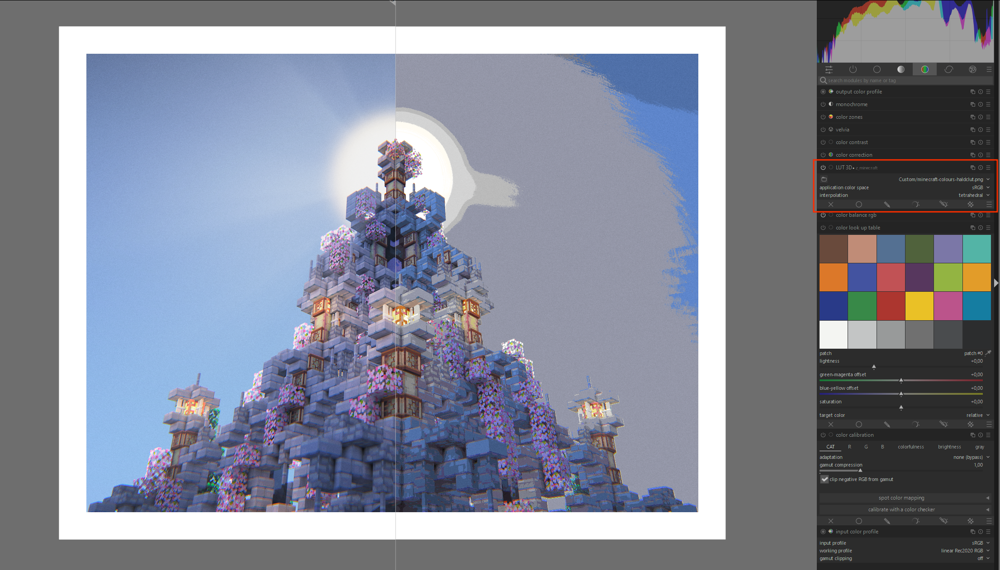

# Minecraft Colour LUTs



This is a simple script to generate a HALD CLUT image (a simple lookup table)
for transforming the RGB colour space to Minecraft colours.
This is useful for editing images which are meant to be displayed ingame
with the use of map items that are put into item frames.

## Setup

```
python -m venv venv
source venv/bin/activate
git clone git@github.com:oiao/clut.git
pip install -e clut
```

## Convert HALD CLUT to CUBE

```
git clone git@github.com:pwnage101/cluttool.git
python cluttool/cluttool/cluttool.py lut.png lut.cube
```

## Use CUBE LUTs for live preview within Minecraft

You can use the `.cube` LUT from the releases
to view your entire Windows Desktop with Minecraft colours,
by using this software:

- https://github.com/ledoge/dwm_lut

## TODO

- Multi-threading (C++?)
- Generate more LUTs for different minecraft versions
- Explain how to use the LUTs

## Resources

- https://mc-map.djfun.de/
- https://github.com/djfun/mc-map-item-tool
- Colours.js
  - http://stevehanov.ca/blog/index.php?id=116
  - http://stevehanov.ca/colours/Colours.js
- https://github.com/pwnage101/cluttool
- https://github.com/oiao/clut
